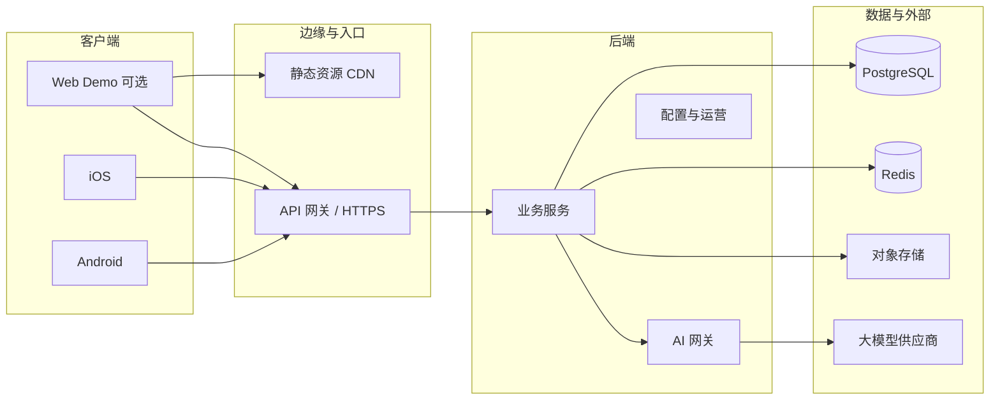

# 系统架构（目标态）

> 状态：**与实现同步演进**。当前试水阶段优先 **Android 原生 App**，聚焦「AI 心理洞察三问」主链路；`backend` 为商用主路径。详见 [`tech-stack.md`](tech-stack.md)。

## 1. 逻辑视图

## 2. AI 洞察三问编排（控制平面 / 执行平面）

- **决策摘要**：[ADR-004：AI Chat 控制平面与初版可演进](decisions/004-agent-backend-control-plane.md)。  
- **接口与表名草案**：[`modules/ai-chat-orchestration.md`](modules/ai-chat-orchestration.md)（含三问生成约束、REST 草图、数据结构、`LlmClient` / `TurnOrchestrator` 边界）。  

逻辑上：`API 与鉴权` → **输入校验（是否为有效问题）** → **可选背景补充** → **三问生成** → **用户作答** → **倾向输出** → 持久化与审计。

## 3. 边界原则

| 层 | 职责 | 非职责（首版） |
|----|------|----------------|
| 客户端 | 展示、输入（文字/语音转文字）、三问作答交互、本地弱缓存、调 API | 存储长期密钥、完整 Prompt 商业策略、权益判定最终源 |
| 业务服务 | 用户、画像、问题记录、三问结果、限流、审计 | 在客户端直连大模型 |
| AI 网关 | 统一模型调用、三问生成约束执行、记录成本、脱敏/过滤、失败降级 | 替代产品运营与法务策略 |
| 数据层 | 持久化、缓存、文件 | 业务规则混写在 SQL 中（应适度收敛到服务层） |

## 4. 与仓库目录的对应

| 目录 | 对应 |
|------|------|
| `demo/web` | 产品/交互验证；可继续作为 H5 原型与实验场 |
| `backend` | 业务 + AI 网关 + 管理接口（随选型落地） |
| `clients/android` | **当前 MVP 主端**：原生实现登录、画像、提问、三问作答、结果反馈 |
| `clients/ios` | 试水期暂不强制；验证后再并行推进 |
| `clients/flutter` | 保持长期双端预留，是否启用取决于试水结果与资源 |

## 5. 数据流（示例：AI 三问洞察）

1. 客户端提交问题 + 用户身份 token
2. `backend` 校验身份、输入有效性与配额
3. 用户可选补充背景（可跳过）
4. `AI 网关` 根据场景生成 3 个关键问题（遵守三问约束）
5. 客户端完成三问作答并回传
6. `backend` 产出倾向性结论并落库
7. 记录调用日志（供成本、质量与问题排查）

**AI 对话主链**的 API/表名草案见 [`modules/ai-chat-orchestration.md`](modules/ai-chat-orchestration.md)；其它业务模块仍见 `docs/modules/` 与后续 ADR。

## 6. 安全与合规（占位）

- 传输：HTTPS
- 鉴权：TBD（JWT、Session、设备绑定等，见 `docs/modules/auth.md` 待建）
- 秘密：`backend` 环境变量 + 云密钥管理
- 隐私：在隐私政策/上架材料中**随阶段** 补全；需求变更时回写 [`product-scope.md`](product-scope.md)
