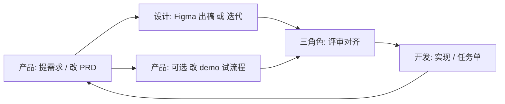

# 三人团队协作工作流（产品 / 设计 / 开发）

> 目标：同一仓库里**可预期地分工**、**可追踪的产出物**、**Demo ↔ 文档 ↔ 设计** 三者尽量同步，减少沟通损耗。  
> 与 [`AGENTS.md`](../AGENTS.md) 互补：本文件管**人角色与流程**，`AGENTS` 管**技术边界**。

## 1. 角色与主责（R&R）

| 角色 | 主责 | 在本仓库的「默认产出」 | 不默认承担（需另约） |
|------|------|------------------------|----------------------|
| **产品** | 目标、范围、优先级、验收标准；维护 **PRD**；**可**直接改 `demo/web` 以验证想法 | `docs/prd/*` 更新；`demo/web` 中与**交互/文案/流程**相关改动；必要时建/更新 `docs/tasks/*` 说明「给开发接力的背景」 | 架构拍板、后端/客户端工程化、视觉最终稿 |
| **设计** | 信息架构、视觉、组件、动效、标注；Figma 为**唯一真源**（Single Source of Truth for UI） | Figma 文件/页面维护；`docs/design/*` 的链接、里程碑说明、**设计交付**清单 | 不强制写业务代码；若**直接**改 `demo` 中样式，建议与**开发**对齐分支与合入方式 |
| **开发** | 可运行实现：后端/客户端/联调/部署/技术债与代码规范 | `backend/*`、`clients/*`、为需求服务的 `demo/web` 工程化与合并；`docs/modules/*`、**任务单** 与联调说明 | 替产品做商业决策、替设计做品牌最终定调 |

> **约定**：任何一方若动到「对其他人有强依赖的交付物」——产品改 PRD 结构、设计改 Figma 主流程、开发改技术栈边界——**必须**走 [`docs/decisions/`](decisions/) 或至少邮件/IM **留痕**，并更新本文档中指向的**索引**。

---

## 2. 固定文件位置（单仓真源）

| 内容 | 放哪里 | 谁主维护 | 说明 |
|------|--------|----------|------|
| 商业与边界（已拍板） | [`product-scope.md`](product-scope.md) | 产品主导，全员可读 | 不写页面级细节，避免和 PRD 争锋 |
| **PRD**（可验收的需求） | [**`docs/prd/`**](./prd/README.md) | 产品 | 一屏/一功能可以拆成多篇，见 [索引](./prd/README.md) |
| 设计真源 + 资源入口 | [**`docs/design/`**](./design/README.md) | 设计 | Figma 链接、命名、交付节奏；**不**在聊天里当唯一链接库 |
| Demo 可运行工程 | `demo/web/` | 产品可改、开发合入/评审 | 产品改交互/流程时，**同时**改对应 PRD |
| 技术栈与端形态 | [`tech-stack.md`](tech-stack.md) | 开发主笔，**架构变更**需产品知晓 | 见 ADR |
| 任务与接力 | `docs/tasks/` | 三方可建；开发收尾为主 | 见 [`tasks/_template.md`](tasks/_template.md) |

### 2.1 PRD 文件命名

- 格式：``docs/prd/NNN-模块或功能-短名.md``（`NNN` 三位数，**递增**，方便引用「PRD-003」类编号）。
- 每个 PRD 内固定包含：**背景 / 目标 / 范围外 / 用户与场景 / 页面与流程 / 与 demo 的对应** / 验收 / **修订记录**（见 [模板](prd/_template.md)）。

### 2.2 设计 Figma 入口

- 所有**对外/对内**的 Figma 主链接、分支规范，集中在 [`docs/design/figma-sources.md`](design/figma-sources.md)。
- 设计在 Figma 内用「页面/框架」与 **PRD 编号** 对齐（在 Figma 描述或页面名中写 `PRD-00x` 可选但强烈建议）。

---

## 3. 标准节奏（轻量、可周更）

本流程不强制日更，**至少**在「有对外里程碑」时跑一遍整链。

1. **产品** 在 `docs/prd/` 新建/更新 PRD，并在 [`prd/README.md`](prd/README.md) **登记索引**（见该文件字段）。
2. **设计** 在 Figma 出稿/细化，在 [`figma-sources.md`](design/figma-sources.md) 里更新**对应**链接与**版本/日期**；大变更写 [`design/CHANGELOG.md`](design/CHANGELOG.md) 一条（新建）。
3. **产品**（推荐）在 `demo/web` 上改**可点流程**，用于验证；**同一次 MR/提交** 内，**必须**在对应 PRD 的「与 demo 对应」和「修订记录」里**写清改了什么**（路径或行为）。
4. **三方评审**：产品讲 PRD 与范围；设计讲 Figma 与**关键交互**；开发讲**技术约束与工期**（必要时拆 `docs/tasks/xxx`）。
5. **开发** 在任务单里**引用** `PRD-00x` + Figma 节点/页面；合入后若实现与 Figma/PRD 有偏差，在任务单或 PRD 修订记录中**记一笔**「为何」。

---

## 4. 强约束（少踩坑规则）

1. **Demo 与 PRD 二选一同步**（推荐两者同步）：  
   - 若**仅**改 `demo/web` 验证想法：**必须** 在同 PR 内更新相关 PRD（至少「修订记录」+「与 demo 的对应」）。  
   - 若**仅**改 PRD 不打算动 demo：在 PRD 里标「**待** demo 验证」或开任务给开发/产品。  
2. **设计稿变更**：设计更新 Figma 后，在 [`design/CHANGELOG.md`](design/CHANGELOG.md) 增加一条，含 **PRD-编号、日期、变更摘要、Figma 位置**。  
3. **开发不猜接口**：以 PRD 验收标准为准；有歧义先拉产品+设计 15 分钟对齐，再改文档或 Figma 注释。  
4. **对外口径**：商业边界以 [`product-scope.md`](product-scope.md) 为准；页面行文案以 **PRD + 设计** 为准。  

---

## 5. 合并前自检（可贴进 PR 说明）

- [ ] 是否涉及 `demo/web` 变更？是则 PRD/修订记录/索引是否已更新？  
- [ ] 是否涉及 Figma 变更？是则 `figma-sources` 或 `design/CHANGELOG` 是否已更新？  
- [ ] 是否涉及**范围/技术栈/合规** 变更？是则是否经产品同意并/或新增 ADR？  
- [ ] 开发联调/上线是否**引用** 任务单或 PRD 编号？  

---

## 6. 与 `docs/tasks/` 的衔接

- 需求类工作尽量对应一条任务：`产品 PRD-008 + 设计 Figma + 实现 xxx`。  
- 开发收尾时在任务中写**handoff**（与 [`AGENTS.md`](../AGENTS.md) 中「任务可接力」一致）。

---

## 7. 谁改本文件

- 工作流、目录约定变更：由**产品**发起，**三角色**在评审后更新；**版本**写在下方。

| 版本 | 日期 | 说明 |
|------|------|------|
| 1.0 | 2026-04-24 | 首版；固定 `docs/prd`、`docs/design` 与同步规则 |
| 1.1 | 2026-04-24 | 附录：PRD/设计先后手、Figma 版本在仓库中的记法 |

---

## 附录 A：工作流怎么「照做」——两种常见顺序

下面两种都**允许**；关键是：**开发开写前，PRD 与 Figma 必须能回答「验什么、长什么样」**，不能靠口传。

### A.1 先 PRD、后设计（推荐主路径）

1. 产品在 `docs/prd/` 建 **PRD-0xx**，在 [`prd/README.md`](prd/README.md) 登记。  
2. 设计在 Figma 出稿，**页面/框架名**建议带 `PRD-0xx`；在 [`figma-sources.md`](design/figma-sources.md) 写**主链** + 该 PRD 的**页面位置**；大改记 [`design/CHANGELOG.md`](design/CHANGELOG.md)。  
3. 产品**可选**改 `demo/web` 试流程；改则**同 PR** 更新 PRD「与 demo 的对应」+「修订记录」。  
4. **评审**：PRD 验收 + Figma 关键交互 + 开发估时 → 开 `docs/tasks/xxx` → 开发实现。

**适用**：需求从业务目标出发，想减少返工、减少「美但落不了地」的稿。

### A.2 先设计、后补 PRD（探索式 / 竞赛式）

1. 设计先在 Figma 出**方向稿**时，在 [`design/CHANGELOG.md`](design/CHANGELOG.md) 记一条「**探索稿**、尚未绑定 PRD」，并保留**日期**。  
2. 产品**尽快**做二选一，并在仓库里**落字**：  
   - **采纳**：新建 **PRD-0xx**，写清**与 Figma 哪一页/哪节点对齐**、验收与范围；并在 [`figma-sources.md`](design/figma-sources.md) 把该稿**绑定到** `PRD-0xx`；**或**  
   - **不采纳 / 仅参考**：Figma 里可移到「探索 / Archive」页，在 CHANGELOG 注明「不进入本迭代」，**开发不跟这张**。  
3. 若**未**补 PRD 就希望开发动：**不允许**以「有图」代替需求——须由产品**至少**补一版**草案 PRD**（状态=草案），并写明「设计先行、PRD 待评审」，**评审过**再进开发。  

**原则**：Figma 可以**先于** PRD 存在，但**进开发前** 必须有**可勾验收**的 PRD 段落（或明写「MVP 仅实现哪些 Frame」）。

### A.3 若「设计已更新、PRD 没跟上」

- 由**产品**在 **48 小时内** 择一：更新对应 PRD「修订记录」、或**新建**子 PRD / 在原文标「**设计变更待合并进 PRD**（日期）」；  
- **设计**在 Figma 评论或 `CHANGELOG` 里写清「影响哪些 PRD」；  
- **开发**遇到 PRD 与 Figma 冲突：**停**，拉产品+设计 15 分钟，**以 PRD 为文字验收、Figma 为稿面为准，冲突现场改文档/稿** 后再写代码。

---

## 附录 B：Figma 只有一个链接，如何做「版本管理」

Figma 的**文件 URL 长期不变**是正常的；**版本**不等于「再给一个链接」，而是**三层**一起用：

| 层次 | 谁做 | 做什么 |
|------|------|--------|
| **Figma 内** | 设计 | 大迭代用 **Figma 自带版本历史** 打点（Named version / 里程碑，视团队与套餐）；分支若团队有 **Branch** 可用来并行稿；发布库若用 **Library** 则按组件版本走。 |
| **仓库里（对开发/产品可核对）** | 设计 + 产品 | 在 [`figma-sources.md`](design/figma-sources.md) **同一行** 更新列：**最后同步日期、当前「开发要对的」说明**；**不**为每次小改换 URL。 在 [`design/CHANGELOG.md`](design/CHANGELOG.md) 用**一行=一次对开发有影响的变更**，写 **PRD-编号、日期、摘要、Figma 页面/Frame**。 |
| **开发任务/PRD 里** | 开发/产品 | 在 **Task 或 PRD** 里写**固定一句**：**「本迭代实现以 YYYY-MM-DD 当日 Figma + CHANGELOG 某条为准」**；如上线前冻结，则写**冻结日期**；与稿不一致时先改文档再改码。 |

**可执行约定**：

- **小改**（色值、边距、文案在稿内调）：`CHANGELOG` **可不记**，但**动到布局/信息架构/新状态** 必须记。  
- **大改**（新页面、改导航、改组件规范）：`CHANGELOG` **必记** + 对应 PRD「修订记录」**必记**（产品）。  
- **同一张图反复改、开发要崩溃时**：在 PRD 或任务单里为「本版」**框定 Frame 名称或 Figma 节点 id**，**开发只认该框**；出下一版时产品/设计在 CHANGELOG+PRD 上**开新版说明**。

---

## 附录 C：和本文 §3 图的关系

§3 的图是**理想顺序**；附录 A 说明**实际顺序**可以变化，但**进开发**前需满足 A.1/A.2 中的**对齐**条件。冲突处理见 A.3。
