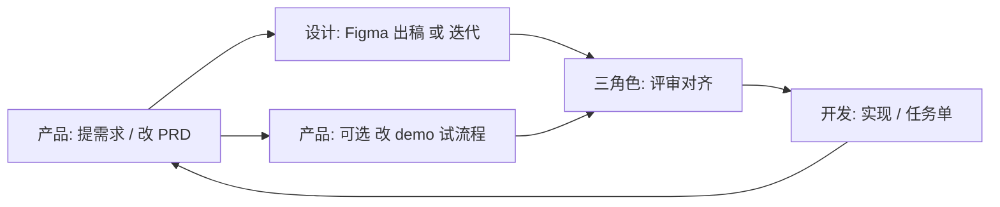

# 三人团队协作工作流（产品 / 设计 / 开发）

> 目标：同一仓库里**可预期地分工**、**可追踪的产出物**、**Demo ↔ 文档 ↔ 设计** 三者尽量同步，减少沟通损耗。  
> 与 [`AGENTS.md`](../AGENTS.md) 互补：本文件管**人角色与流程**，`AGENTS` 管**技术边界**。

## 1. 角色与主责（R&R）

| 角色 | 主责 | 在本仓库的「默认产出」 | 不默认承担（需另约） |
|------|------|------------------------|----------------------|
| **产品** | 目标、范围、优先级、验收标准；维护 **PRD**；**可**直接改 `demo/web` 以验证想法 | `docs/prd/*` 更新；`demo/web` 中与**交互/文案/流程**相关改动；必要时建/更新 `docs/tasks/*` 说明「给开发接力的背景」 | 架构拍板、后端/客户端工程化、视觉最终稿 |
| **设计** | 信息架构、视觉、组件、动效、标注；Figma 为**唯一真源**（Single Source of Truth for UI） | Figma 文件/页面维护；`docs/design/*` 的链接、里程碑说明、**设计交付**清单 | 不强制写业务代码；若**直接**改 `demo` 中样式，建议与**开发**对齐分支与合入方式 |
| **开发** | 可运行实现：后端/客户端/联调/部署/技术债与代码规范 | `backend/*`、`clients/*`、为需求服务的 `demo/web` 工程化与合并；`docs/modules/*`、**任务单** 与联调说明 | 替产品做商业决策、替设计做品牌最终定调 |

> **约定**：任何一方若动到「对其他人有强依赖的交付物」——产品改 PRD 结构、设计改 Figma 主流程、开发改技术栈边界——**必须**走 [`docs/decisions/`](decisions/) 或至少邮件/IM **留痕**，并更新本文档中指向的**索引**。

---

## 2. 固定文件位置（单仓真源）

| 内容 | 放哪里 | 谁主维护 | 说明 |
|------|--------|----------|------|
| 商业与边界（已拍板） | [`product-scope.md`](product-scope.md) | 产品主导，全员可读 | 不写页面级细节，避免和 PRD 争锋 |
| **PRD**（可验收的需求） | [**`docs/prd/`**](./prd/README.md) | 产品 | 一屏/一功能可以拆成多篇，见 [索引](./prd/README.md) |
| 设计真源 + 资源入口 | [**`docs/design/`**](./design/README.md) | 设计 | Figma 链接、命名、交付节奏；**不**在聊天里当唯一链接库 |
| Demo 可运行工程 | `demo/web/` | 产品可改、开发合入/评审 | 产品改交互/流程时，**同时**改对应 PRD |
| 技术栈与端形态 | [`tech-stack.md`](tech-stack.md) | 开发主笔，**架构变更**需产品知晓 | 见 ADR |
| 任务与接力 | `docs/tasks/` | 三方可建；开发收尾为主 | 见 [`tasks/_template.md`](tasks/_template.md) |

### 2.1 PRD 文件命名

- 格式：``docs/prd/NNN-模块或功能-短名.md``（`NNN` 三位数，**递增**，方便引用「PRD-003」类编号）。
- 每个 PRD 内固定包含：**背景 / 目标 / 范围外 / 用户与场景 / 页面与流程 / 与 demo 的对应** / 验收 / **修订记录**（见 [模板](prd/_template.md)）。

### 2.2 设计 Figma 入口

- 所有**对外/对内**的 Figma 主链接、分支规范，集中在 [`docs/design/figma-sources.md`](design/figma-sources.md)。
- 设计在 Figma 内用「页面/框架」与 **PRD 编号** 对齐（在 Figma 描述或页面名中写 `PRD-00x` 可选但强烈建议）。

---

## 3. 标准节奏（轻量、可周更）

本流程不强制日更，**至少**在「有对外里程碑」时跑一遍整链。

1. **产品** 在 `docs/prd/` 新建/更新 PRD，并在 [`prd/README.md`](prd/README.md) **登记索引**（见该文件字段）。
2. **设计** 在 Figma 出稿/细化，在 [`figma-sources.md`](design/figma-sources.md) 里更新**对应**链接与**版本/日期**；大变更写 [`design/CHANGELOG.md`](design/CHANGELOG.md) 一条（新建）。
3. **产品**（推荐）在 `demo/web` 上改**可点流程**，用于验证；**同一次 MR/提交** 内，**必须**在对应 PRD 的「与 demo 对应」和「修订记录」里**写清改了什么**（路径或行为）。
4. **三方评审**：产品讲 PRD 与范围；设计讲 Figma 与**关键交互**；开发讲**技术约束与工期**（必要时拆 `docs/tasks/xxx`）。
5. **开发** 在任务单里**引用** `PRD-00x` + Figma 节点/页面；合入后若实现与 Figma/PRD 有偏差，在任务单或 PRD 修订记录中**记一笔**「为何」。

---

## 4. 强约束（少踩坑规则）

1. **Demo 与 PRD 二选一同步**（推荐两者同步）：  
   - 若**仅**改 `demo/web` 验证想法：**必须** 在同 PR 内更新相关 PRD（至少「修订记录」+「与 demo 的对应」）。  
   - 若**仅**改 PRD 不打算动 demo：在 PRD 里标「**待** demo 验证」或开任务给开发/产品。  
2. **设计稿变更**：设计更新 Figma 后，在 [`design/CHANGELOG.md`](design/CHANGELOG.md) 增加一条，含 **PRD-编号、日期、变更摘要、Figma 位置**。  
3. **开发不猜接口**：以 PRD 验收标准为准；有歧义先拉产品+设计 15 分钟对齐，再改文档或 Figma 注释。  
4. **对外口径**：商业边界以 [`product-scope.md`](product-scope.md) 为准；页面行文案以 **PRD + 设计** 为准。  

---

## 5. 合并前自检（可贴进 PR 说明）

- [ ] 是否涉及 `demo/web` 变更？是则 PRD/修订记录/索引是否已更新？  
- [ ] 是否涉及 Figma 变更？是则 `figma-sources` 或 `design/CHANGELOG` 是否已更新？  
- [ ] 是否涉及**范围/技术栈/合规** 变更？是则是否经产品同意并/或新增 ADR？  
- [ ] 开发联调/上线是否**引用** 任务单或 PRD 编号？  

---

## 6. 与 `docs/tasks/` 的衔接

- 需求类工作尽量对应一条任务：`产品 PRD-008 + 设计 Figma + 实现 xxx`。  
- 开发收尾时在任务中写**handoff**（与 [`AGENTS.md`](../AGENTS.md) 中「任务可接力」一致）。

---

## 7. 谁改本文件

- 工作流、目录约定变更：由**产品**发起，**三角色**在评审后更新；**版本**写在下方。

| 版本 | 日期 | 说明 |
|------|------|------|
| 1.0 | 2026-04-24 | 首版；固定 `docs/prd`、`docs/design` 与同步规则 |
